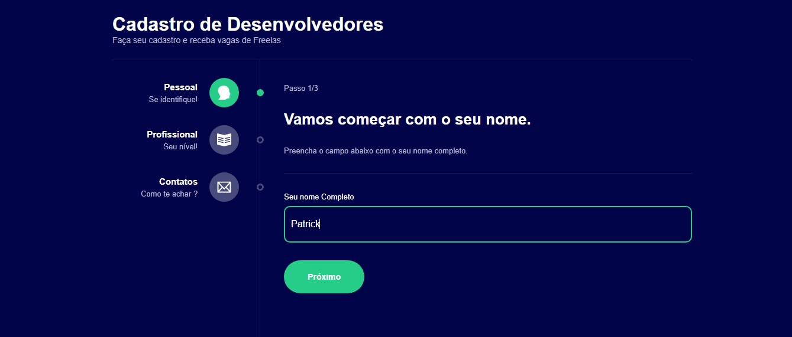

<h1 align="center">
✨ MultForm
</h1>

<h3 align="center">Deploy <a href="https://exquisite-cassata-7fd416.netlify.app/">Acess</a></h3>

<div>
   
</div>
<div>
   
</div>
<div>
   
</div>

### 🌌 Tecnologias 🌌

- Typescript
- ReactJs

## 📚 Libs

- styled-components
- react-router-dom

## 💾 Clone

```sh
git clone https://github.com/setxpro/Formulario-multi-etapas.git
```

## Author

```sh
👤 Patrick Anjos
```

* Github: [@setxpro](https://github.com/setxpro)
## Under construction to the next level 🚀<br/>
